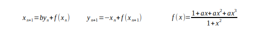
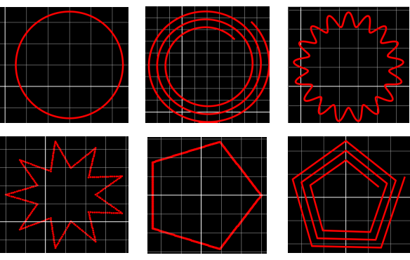
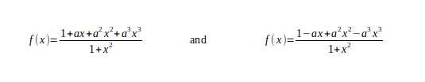
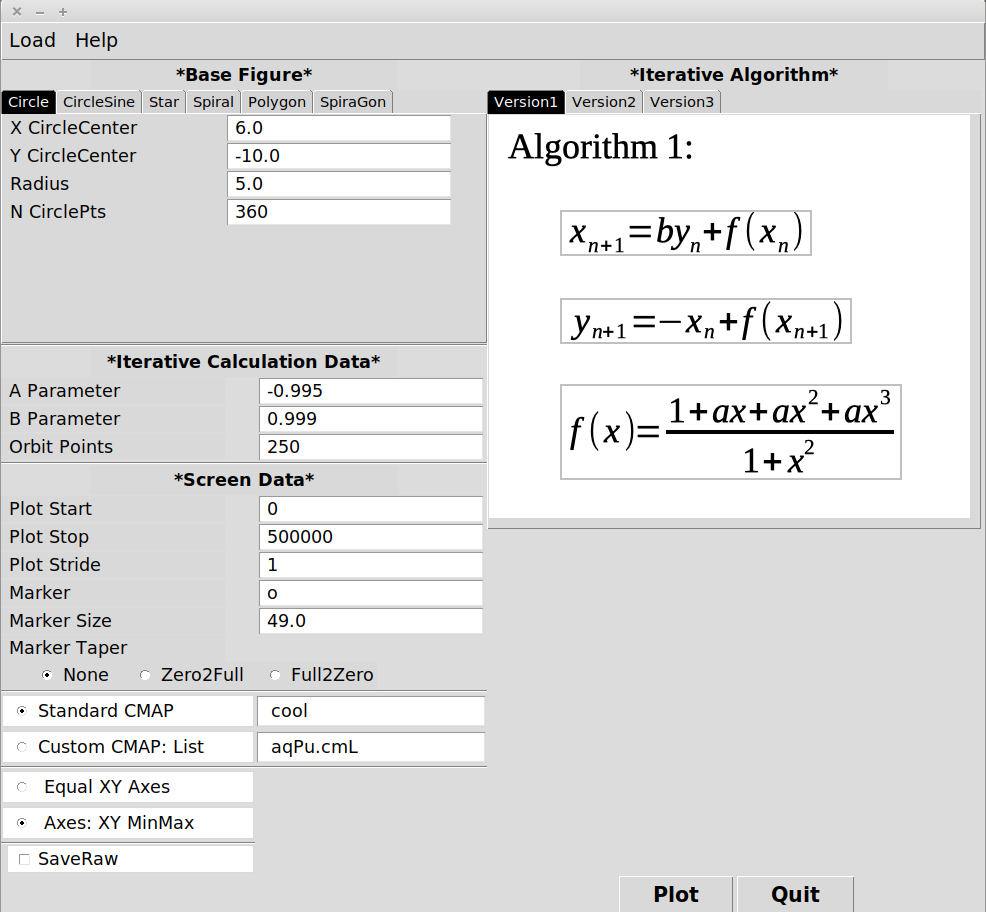
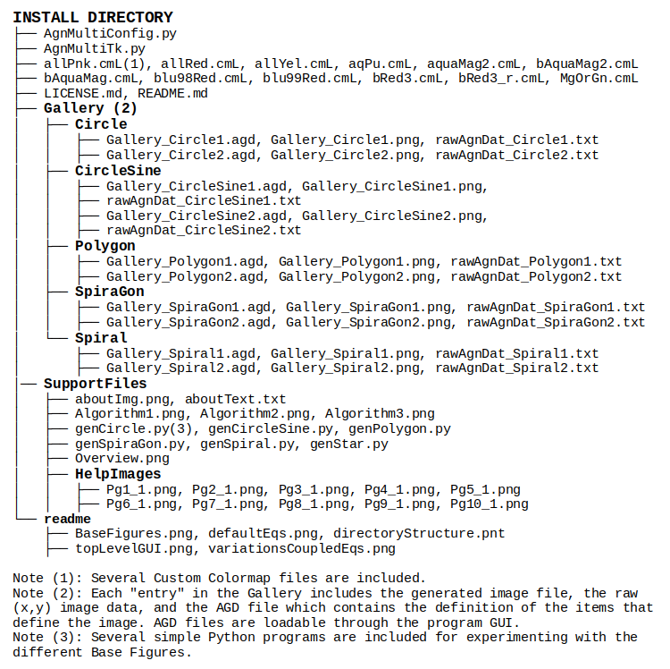

# Witch of Agnesi Fractal Generator With Variations

This fractal generator is derived from the description given in Reference[1], which provides a creative method to generate images that are loosely connected to the Witch of Agnesi, and also to fractal images defined by Igor Gumowski and Christian Mira.

Briefly, the legacy algorithm starts with N points on a circle. Each of the N points is then separately updated for M iterations using a set of coupled equations in the x-y plane. The total collection of N*M points is then plotted. The default coupled equations are given by:

 

This fractal generator adds several additional Base Figures to the default circle. Examples of the full set are shown below:

 

The Base Figures are: circles; spirals; circles with a radius that varies as a sine function (named CircleSine); star; regular polygon; regular polygon with a spiraling vertex radius (named SpiraGon). For each of these Base Figures, the user may set: (x,y) coordinates of the center; parameters that define its size; and, the number of (x,y) points in the Base Figure. Several Base Figures (Spiral, Polygon, SpiraGon) can be rotated from their default position. (For example, see the image of the Spiral, above.) Others include: the number of turns (Spiral, SpiralGon); or, the number of edges (Polygon, SpiralGon). In addition, the number of "spikes" in the Star and the number of "lumps" in the CircleSine can be set.

The user may also choose the Iterative Equation that operates on each point in the Base Figure. In addition to the default equation shown above, the user may also choose from the following:

 

Then, the user can set the "a" and "b" parameters in the Iterative Equations and the number of iterations to calculate (Orbits Points) for each point in the Base Figure.

The full top-level GUI is shown below:

 

In addition to the parameters for the iterative calculations, the user can also select a number of elements that affect the screen display, including:
**Plot Start, Stop** - first, last element to plot from full data set
**Plot Stride** - how many iterations to step to next point
**Marker** - several common markers are o(circle), p(pentagon), ^(triangle up), D(diamond)
**Marker Taper** - gradually change marker size across full range of data
**ColorMap** - either a standard Matplotlib CMAP, or a user-defined color map (see program Help for details)
**Equal or MinMax Axes** - allows user to select whether plot window is based on configuration data, or forced to be square

## Program Environment
This program was written for the Python3 environment on a Linux platform. The program was written and extensively tested on a Dell XPS-8700 desktop computer using Linux Mint 20.2 64-bit with Nvidia GeForce GT 635 graphics. Additional testing was performed on an HP laptop using the same Linux Mint release with AMD Radeon R4/R5 Graphics. The testing was repeated on the same laptop using Windows 10. Finally, the same testing was performed on an iMac19,2 running the Catalina OS with the Radeon Pro 555X graphics.

###Dependencies
Python3, Matplotlib, Tkinter, Numpy, Pillow(PIL fork)

###Installation/Usage
Download the package to your desired Install Directory and unzip the file. The program can then be run by opening a terminal (Linux and Mac), changing to your Install Directory, and entering the following:

        python3 AgnMultiTk.py

Alternatively, make the AgnMultiTk.py executable, and run the script directly:

        chmod +x ./AgnMultiTk.py
        ./AgnMultiTk.py

On the Windows 10 platform, first open a PowerShell window, change to your Install Directory and enter:

        python AgnMultiTk.py

###Directory Structure
The AgnMultiTk directory structure follows:

 

## References
[1] "The geometric principles behind discrete dynamical systems based on the generalized Witch of Agnesi" by mAnasa-taraMgiNI
